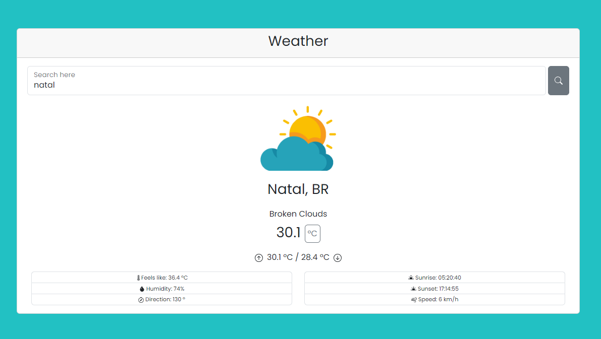

# Weather App

This is a solution to the mixing study #React , #TypeScript and #Bootstrap integration. It helped me improve my coding skills by building realistic projects.

## Table of contents

- [Overview](#overview)
  - [The challenge](#the-challenge)
  - [Screenshot](#screenshot)
  - [Links](#links)
- [My process](#my-process)
  - [Built with](#built-with)
  - [What I learned](#what-i-learned)
- [Author](#author)

**Note: Delete this note and update the table of contents based on what sections you keep.**

## Overview

### The challenge

Users should be able to:

- View temperature and some other info about weather around any city

### Screenshot



### Links

- Live Site URL: [Here](https://mikael-espinola.github.io/weather)

## My process

### Built with

- React
- TypeScript
- BootStrap 5 - for style
- Redux - for state management

### What I learned

This projetct allowed me to better understand the integration of TSX with Bootstrap and all its componetization and styling tools available.

```js
return (
  <Form
    onSubmit={handleSubmit}
    style={{ width: "100%" }}
    className="d-flex justify-content-evenly"
  >
    <Form.Group style={{ width: "95%" }}>
      <Form.Floating style={{ width: "100%" }}>
        <Form.Control
          id="cityName"
          type="text"
          placeholder="Enter city name here"
          required
          onChange={handleOnChange}
        />
        <Form.Label>Search here</Form.Label>
      </Form.Floating>
    </Form.Group>
    <Button
      onClick={handleSubmit}
      variant="secondary"
      style={{ display: "flex", alignItems: "center" }}
    >
      <Search />
    </Button>
  </Form>
);
```

In addition to gaining a better understanding of state management by applying Redux to the application.

```js
const apiSlice = createSlice({
  name: "apiData",
  initialState,
  reducers: {
    getData(state, action) {
      return {
        ...state,
        weatherData: action.payload,
      };
    },
  },
});
```

## Author

- linkedIn - [Mikael Espínola](https://www.linkedin.com/in/mikaelespinola)
- E-mail - [Send me a message here](mailto:mikaelespinolaa@gmail.com)
